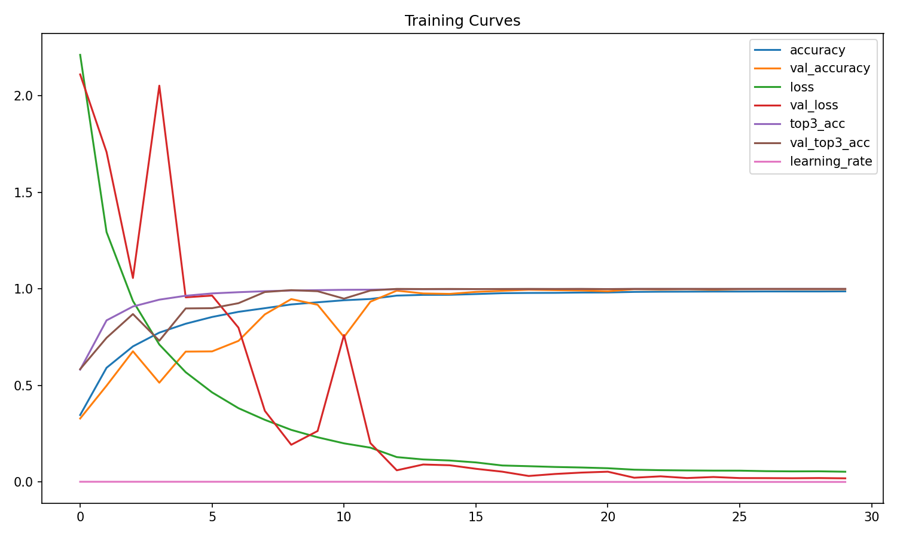
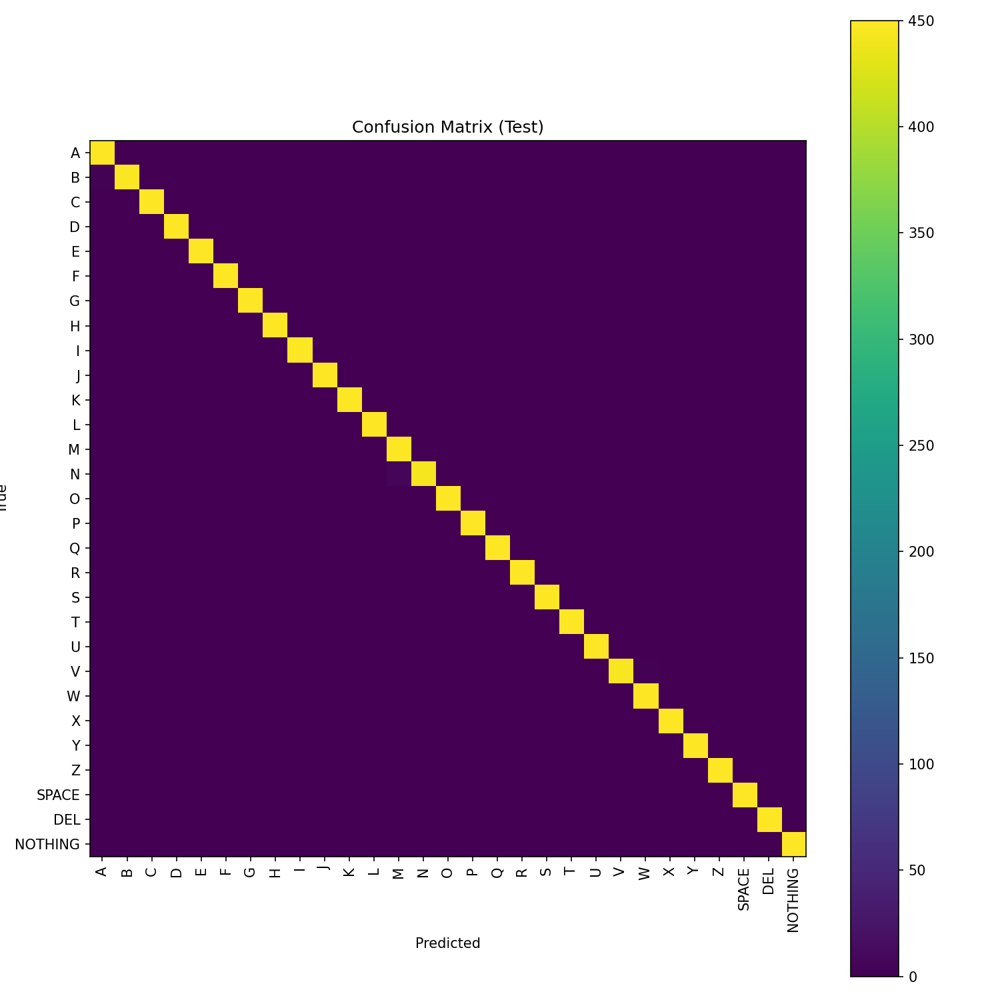

# SpeakEZ — ASL A–Z Baseline Model Report

**Model:** Baseline CNN (32→64→128) + BN + ReLU + GlobalAvgPool + Dense  
**Input Resolution:** 128×128×3  
**Parameters:** 97,885

## 1. Architecture

## 2. Training Curves
If trained in this runtime, curves are below; otherwise save `history.json` to artifacts and re-run this notebook.

## 3. Validation/Test Performance
See printed metrics above. Detailed per-class metrics are in `classification_report.txt`.

## 4. Confusion Matrix (Test)

## 5. Notes
- Similar-sign pairs (M↔N, U↔V↔SPACE) may show clustered confusions.
- Label smoothing (ε=0.05) and temporal smoothing at inference are applied/encouraged.
- Use `/content/speakez_artifacts/labels.json` for consistent downstream mapping.
